# Проект по автоматизации тестовых сценариев для сайта компании [Tinkoff](https://www.tinkoff.ru)
<p align="center"><a href="https://www.tinkoff.ru"></a></p>  

> Tinkoff - российский коммерческий банк, сфокусированный полностью на дистанционном обслуживании, не имеющий розничных отделений. Крупнейший в мире онлайн-банк по количеству клиентов.  

## :notebook: Содержание:

- [Стек технологий](#computer-стек-технологий)  
- [Тестовые сценарии](#clipboard-тестовые-сценарии)
- [Сборка в Jenkins](#-сборка-в-jenkins)
- [Команда для запуска](#rocket-команда-для-запуска)
- [Allure отчет](#allure-отчет)
- [Интеграция с Allure TestOps](#img-srcimageslogoalluretestopssvg-width50-height50-интеграция-с-allure-testops)
- [Интеграция с Jira](#img-srcimageslogojirasvg-width50-height50-интеграция-с-jira)
- [Уведомления в Telegram чат с ботом](#img-srcimageslogotelegramsvg-width50-height50-уведомления-в-telegram-чат-с-ботом)
- [Видео запуска тестов в Selenoid](#img-srcimageslogoselenoidsvg-width50-height50-видео-запуска-тестов-в-selenoid)  

---

## :computer: Стек технологий
<p align="center">
<a href="https://www.java.com/"></a>
<a href="https://www.jetbrains.com/idea/"></a>
<a href="https://www.github.com/"></a>
<a href="https://www.gradle.org/"></a>
<a href="https://www.junit.org/junit5/"></a>
<a href="https://www.selenide.org/"></a>
<a href="https://www.aerokube.com/selenoid/"></a>
<a href="https://www.jenkins.io/"></a>
<a href="https://github.com/allure-framework/allure2"></a>
<a href="https://www.qameta.io/"></a>
<a href="https://www.atlassian.com/software/jira"></a>
<a href="https://www.telegram.org/"></a>
</p>

---

## :clipboard: Тестовые сценарии

- :white_check_mark: Главная страница
    - :heavy_check_mark: Проверка появления списка подсказок в поисковой строке
    - :heavy_check_mark: Проверка элементов списка из меню на главной странице
- :white_check_mark: Раздел "Дебетовые карты"
    - :heavy_check_mark: Проверка заголовка раздела 'Дебетовые карты'
    - :heavy_check_mark: Проверка выбранной опции в фильтре карт при переходе в раздел
- :white_check_mark: Раздел "Кредиты и ипотека"
  - :heavy_check_mark: Проверка заполнения поля 'Цель кредита' при выборе значения из списка
  - :heavy_check_mark: Проверка наличия 3-х шагов по составлению заявки на кредит
- :white_check_mark: Раздел "Вклады"
    - :heavy_check_mark: Проверка сокрытия сообщения при нажатии на чекбокс
    - :heavy_check_mark: Проверка отображения информации при наведении на тултип

---

##  Сборка в Jenkins

<p align="center">
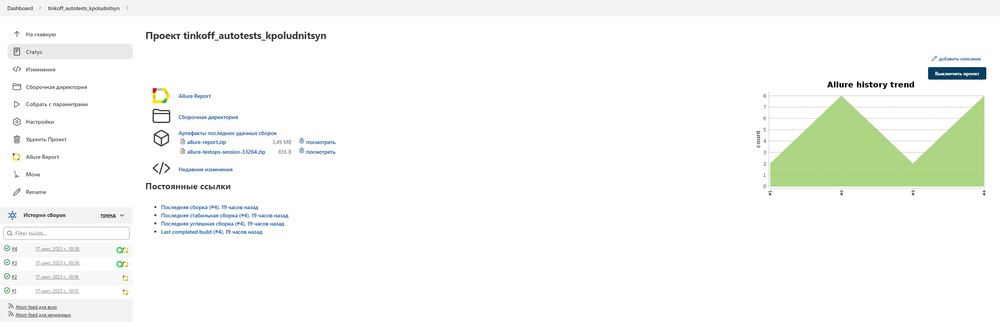
</p>

### Параметры сборки проекта

| Параметр        | Назначение                               |
|-----------------|------------------------------------------|
| SELENOID_URL    | Удаленный сервер для запуска тестов      |
| BROWSER         | Браузер для запуска                      |
| BROWSER_VERSION | Версия браузера                          |
| BROWSER_SIZE    | Разрешение экрана                        |
| COMMENT         | Комментарий                              |
| TASK            | Опция выбора запуска определённых тестов |

### Запуск тестов с параметрами в **Jenkins**

<p align="center">
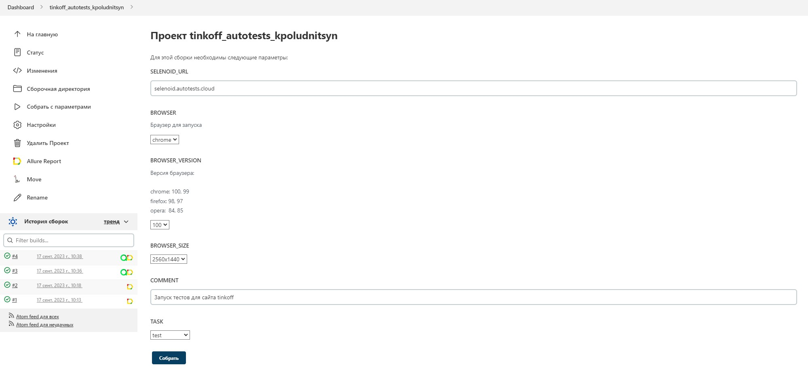
</p>

---

## :rocket: Команда для запуска

```bash
clean
${TASK}
-Dbrowser=${BROWSER}
-DbrowserSize=${BROWSER_SIZE}
-DbrowserVersion=${BROWSER_VERSION}
-DselenoidUrl=${SELENOID_LINK}
```

---

##  Allure отчет

### Главная страница отчета

<p align="center">
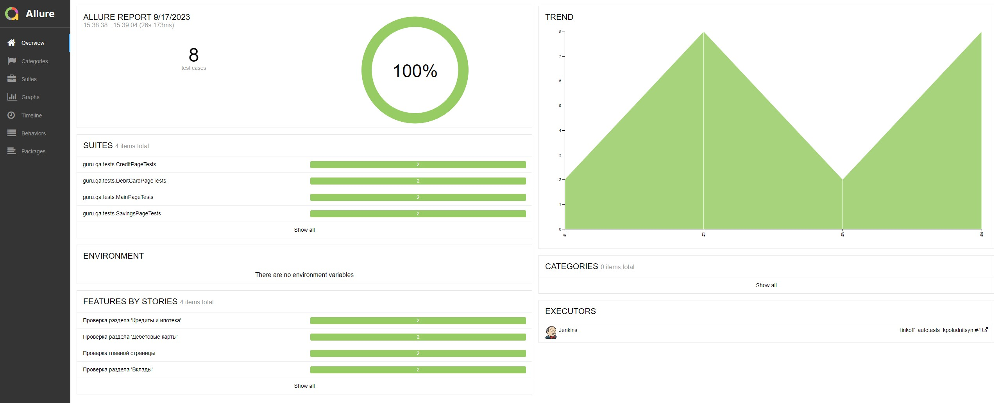
</p>

### Тест-кейсы

<p align="center">
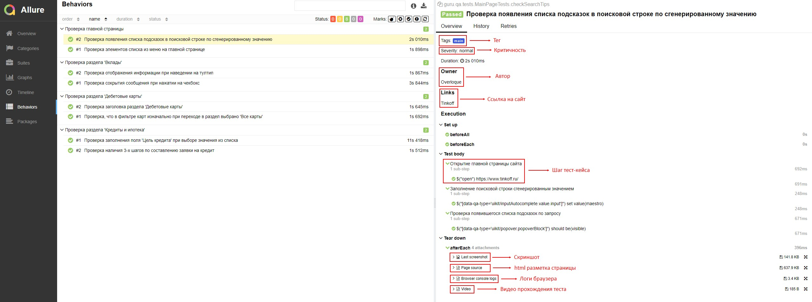
</p>

#### Содержание тест-кейсов

- :heavy_check_mark: Подробное описание шагов
- :heavy_check_mark: Тег
- :heavy_check_mark: Критичность теста
- :heavy_check_mark: Автор
- :heavy_check_mark: Ссылка на раздел сайта (для каждый тестов свой раздел)
- :heavy_check_mark: Последний скриншот для каждого теста 
- :heavy_check_mark: HTML разметка страницы
- :heavy_check_mark: Логи браузера
- :heavy_check_mark: Видео с прохождением теста

### Графики

<p align="center">
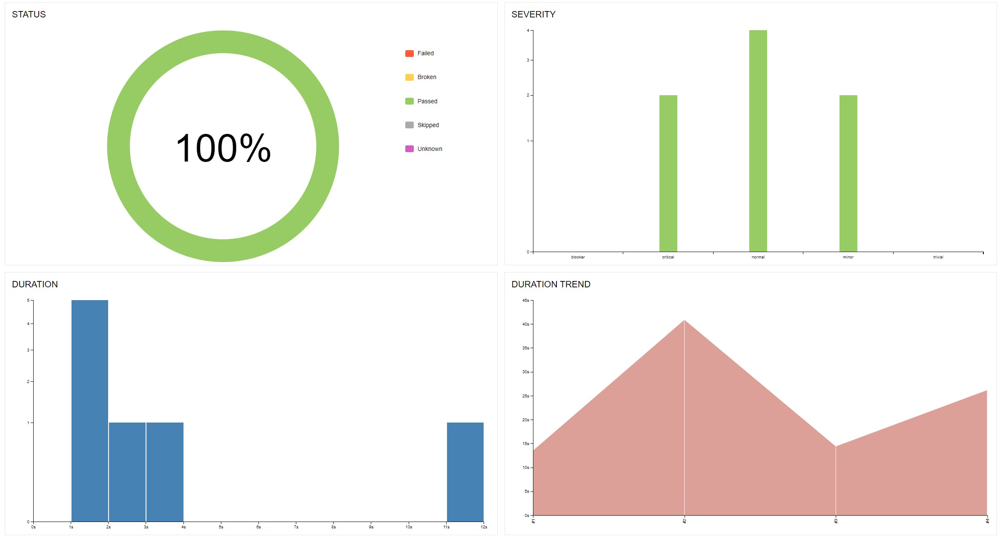
</p>

---

##  Интеграция с Allure TestOps

### Dashboard

<p align="center">
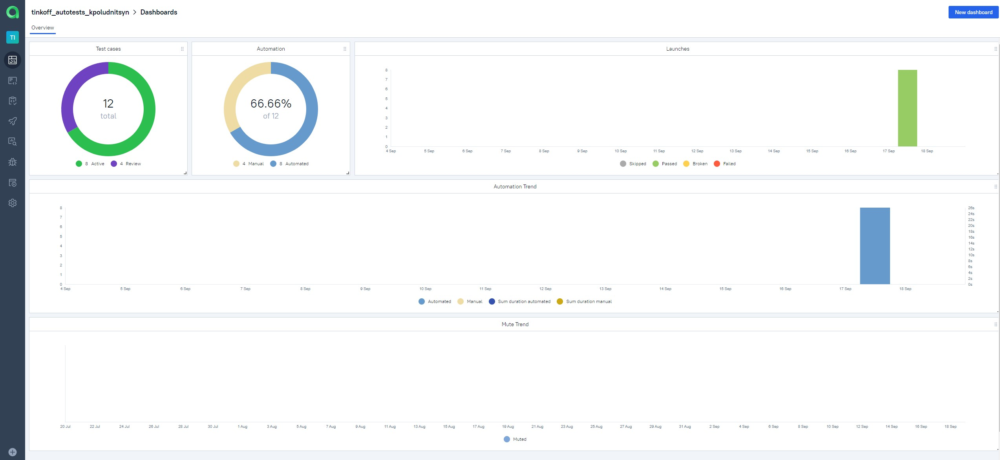
</p>

### Ручные и автоматизированные тест-кейсы

<p align="center">
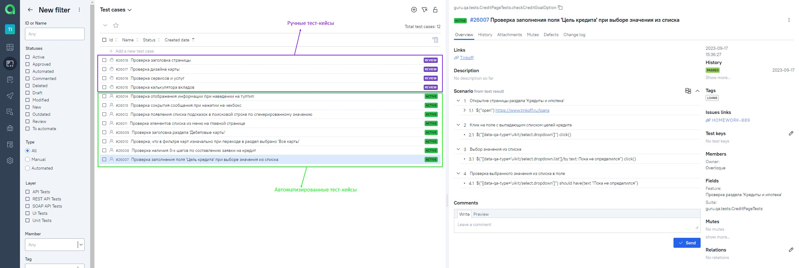
</p>

### Запуск автоматизированных тестов в **TestOps**

<p align="center">
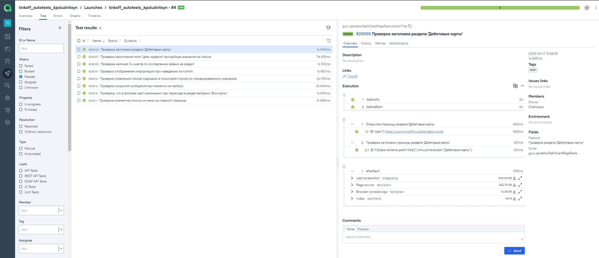
</p>

---

##  Интеграция с Jira

### Задача в Jira

<p align="center">
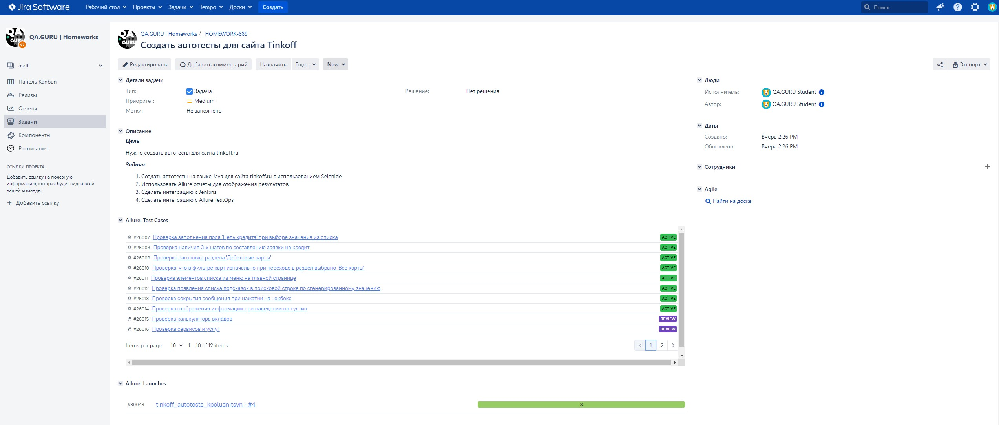
</p>

#### Содержание задачи

- :heavy_check_mark: Цель
- :heavy_check_mark: Задачи для выполнения
- :heavy_check_mark: Тест-кейсы из Allure TestOps
- :heavy_check_mark: Результат прогона тестов в Allure TestOps

---

##  Уведомления в Telegram чат с ботом

### Уведомление из переписки с чат ботом

<p align="center">
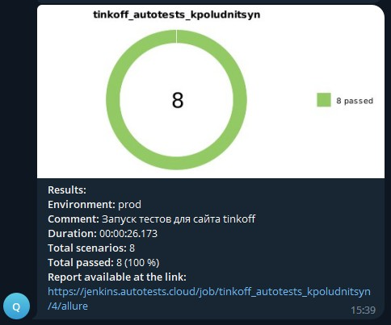
</p>


#### Содержание уведомления в Telegram

- :heavy_check_mark: Окружение
- :heavy_check_mark: Комментарий
- :heavy_check_mark: Длительность прохождения тестов
- :heavy_check_mark: Общее количество сценариев
- :heavy_check_mark: Процент прохождения тестов
- :heavy_check_mark: Ссылка на Allure отчет

---

##  Видео запуска тестов в Selenoid

<p align="center">
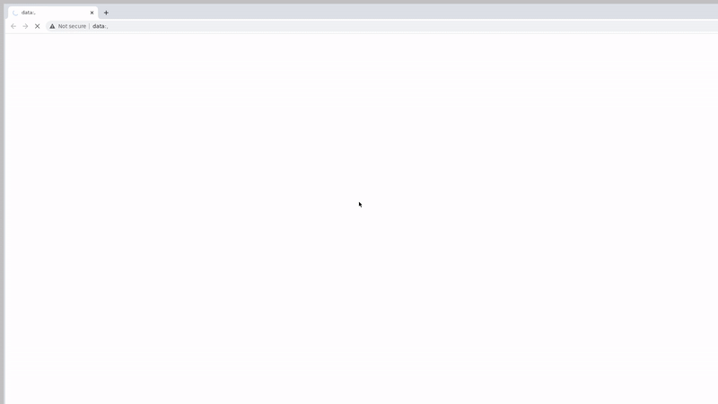
</p>


